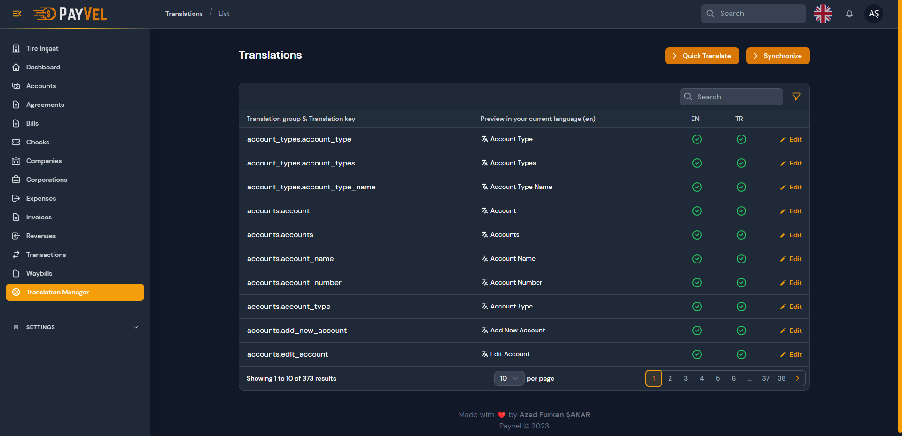

# <p align="center"></p>

**PayVel** is a pre-accounting program made with FilamentPHP. With PayVel, you can keep account of account management, payments you make or receive against companies. It is suitable for all kinds of small and medium-sized businesses.

## Requirements

-   PHP 8.1 or higher
-   MySQL
-   Composer
-   NodeJS
-   Apache or Nginx

## Demo

-   [Demo](https://payvel.afsakar.com)
-   **Email**: superadmin@example.com 
-   **Password**: password

## Installation

```bash
composer install
npm install
cp .env.example .env
php artisan key:generate
php artisan storage:link

SETTING UP DB CONNECTION IN .env
DB_CONNECTION=mysql
DB_HOST=127.0.0.1
DB_PORT=3306
DB_DATABASE=payvel
DB_USERNAME=root
DB_PASSWORD=

php artisan migrate:fresh --seed

START THE SERVER
npm run dev
php artisan serve

Change canAccessFilament method to true in User Model.
```

## Features

- Translation management
- Account management
- Customer/Supplier management
- Invoice management
- Payment management
- Expense management


## Screenshots

<p align="center">
&nbsp;
&nbsp;
&nbsp;
&nbsp;
&nbsp;
&nbsp;
&nbsp;
&nbsp;
&nbsp;
&nbsp;
</p>

## License

The PayVel is open-sourced software licensed under the [MIT license](https://opensource.org/licenses/MIT).

## Credits

- [Filament](https://filamentphp.com)
- [Laravel](https://laravel.com)
- [Azad Furkan ŞAKAR](https://github.com/afsakar)

## Support

If you need support, please email me at [info@afsakar.com](mailto:info@afsakar.com)

## Donate

If you liked this project, you can donate to support it.

<a href="https://www.buymeacoffee.com/afsakar" target="_blank"></a>
